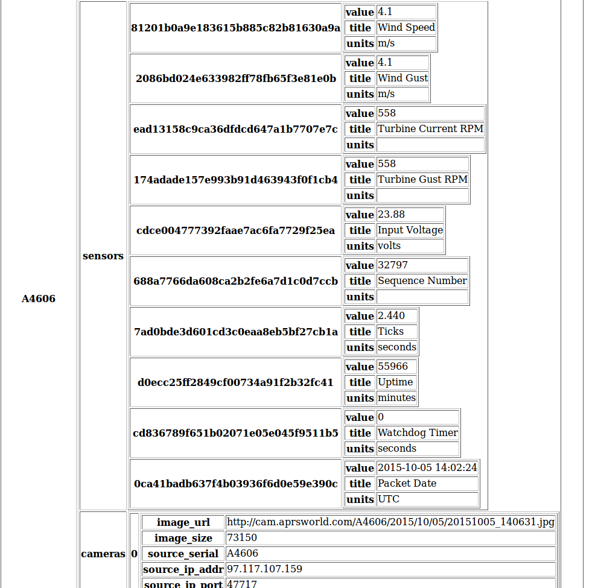

# Format of Stations

 In order for tree nodes (stations) to display correctly, they need to be in the correct format

Currently, a station consists of the following properties:

1. **sensors**
2. **cameras**
3. **title**

###sensors

in order for a sensor to show up with all of the default properties, it will need the following child properties:

1. title - which will be the text that displays in the tree for that sensor - this overrides what is likely to be a bunch of random characters that serve as the sensor's id
2. units - the units that are associated with the value (ex: feet, degrees celsius, seconds, etc.)
3. value - the value for that sensor

###cameras

Cameras will be represented by a number counting up from zero and will appear under the cameras node in the tree

The only required property is the image_url which determines the source for the camera image - other properties can be optionally included

###title

 this optional property is used to set the title of the station, which is set to the serial number by default.
 
# Example
This excludes the optional title property

Code:
```
{
    "A4606": {
        "sensors": {
            "81201b0a9e183615b885c82b81630a9a": {
                "value": 0,
                "title": "Wind Speed",
                "units": "m/s"
            },
            "2086bd024e633982ff78fb65f3e81e0b": {
                "value": 0,
                "title": "Wind Gust",
                "units": "m/s"
            },
            "ead13158c9ca36dfdcd647a1b7707e7c": {
                "value": 0,
                "title": "Turbine Current RPM",
                "units": ""
            },
            "174adade157e993b91d463943f0f1cb4": {
                "value": 0,
                "title": "Turbine Gust RPM",
                "units": ""
            },
            "cdce004777392faae7ac6fa7729f25ea": {
                "value": "23.88",
                "title": "Input Voltage",
                "units": "volts"
            },
            "688a7766da608ca2b2fe6a7d1c0d7ccb": {
                "value": 41172,
                "title": "Sequence Number",
                "units": ""
            },
            "7ad0bde3d601cd3c0eaa8eb5bf27cb1a": {
                "value": "2.440",
                "title": "Ticks",
                "units": "seconds"
            },
            "d0ecc25ff2849cf00734a91f2b32fc41": {
                "value": 56310,
                "title": "Uptime",
                "units": "minutes"
            },
            "cd836789f651b02071e05e045f9511b5": {
                "value": 0,
                "title": "Watchdog Timer",
                "units": "seconds"
            },
            "0ca41badb637f4b03936f6d0e59e390c": {
                "value": "2015-10-05 20:16:23",
                "title": "Packet Date",
                "units": "UTC"
            }
        },
        "cameras": [
            {
                "image_url": "http://cam.aprsworld.com/A4606/2015/10/05/20151005_202031.jpg",
                "image_size": 89114,
                "source_serial": "A4606",
                "source_ip_addr": "97.117.107.159",
                "source_ip_port": "48839"
            }
        ]
    }
}
```
Result:
